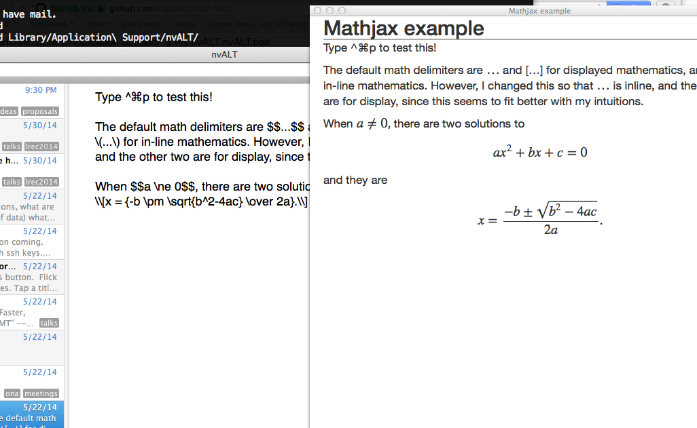

### nvALT configuration files

I use nvALT extensively for research notes.  The files in this archive
provide these functions:

- [Bootstrap](http://getbootstrap.com)-based,
  [MathJAX](http://www.mathjax.org)-enabled templates for previews
- An Automator workflow implementing a Finder service that archives
  image files to a canonical location and copies a
  [Markdown](http://daringfireball.net/projects/markdown/)-formatted
  image URL to that image, enabling each incorporation of images.

Here is an example of the nvALT window with a MathJAX-enabled preview:

These templates began with templates
[published by Brett Terpstra](http://brettterpstra.com/2013/04/06/customizing-the-nvalt-preview/). I
modified them to remove evidence of the "Lopash" them and to add
support for [MathJAX](http://www.mathjax.org).

### What you'll get

* Support for [MathJAX](http://www.mathjax.org) in notes
* Automatic highlighting of code blocks with [highlight.js](http://softwaremaniacs.org/soft/highlight/en/)
* A basic implementation of [Widon't](http://shauninman.com/archive/2006/08/22/widont_wordpress_plugin) for headlines.
* Smooth scrolling when clicking footnotes and anchors.
* A "back to top" link that appears when scrolling down a note.

### Installation

0. Download and install [nvALT](http://brettterpstra.com/projects/nvalt/).

1. First, back up any custom files you've created previously. These
files are located under `$HOME/Library/Application Support/nvALT/`.

    $ cd "$HOME/Library/Application Support/"
    $ mv nvALT nvALT.bak

2. Move or download this archive to that location:

    $ cd "$HOME/Library/Application Support/"
    $ git clone git@github.com:mjpost/nvALT-files nvALT

3. Download and install MathJAX to the directory `mathjax` in the
`nvALT` directory above.

   You should now have the following files in your Support folder:

        custom.css
        highlight.pack.js
        jquery.min.js
        template.html
        mathjax/
          README.md
          MathJax.js
          ...

4. Install the Automator workflow by double-clicking on the file
`nvALT archive.workflow`. 

5. Install a keyboard shortcut for the workflow. Place it under System Preferences →
Keyboard → Shortcuts → App Shortcuts → All Applications. The name
should be "nvALT archive" (exactly). I use ^⌘a as my shortcut.

   Now, on any image file in Finder, you can click this shortcut (or
   select it from the Finder Services menu. The image will be copied
   to a directory within `$HOME/Library/Application
   Support/nvALT/Media/{YEAR}/{MONTH}`, and a Markdown-formatted relative path to this
   file will be placed on the clipboard, to be pasted into your nvALT document.
